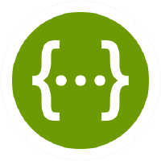

.. This work is licensed under a Creative Commons Attribution 4.0 International License.
.. http://creativecommons.org/licenses/by/4.0
.. Copyright (C) 2022 Nordix

.. _api_docs:

.. |yaml-icon| image:: ./images/yaml_logo.png
                  :width: 40px

========
API-Docs
========

Here we describe the APIs to access the Non-RT RIC DMaaP Mediator Producer.

DMaaP Mediator Producer
=======================

The DMaaP Mediator Producer provides support for push delivery of any data received from DMaaP or Kafka.

See `DMaaP Mediator Producer API <./dmaap-mediator-producer-api.html>`_ for full details of the API.

The API is also described in Swagger-JSON and YAML:

.. csv-table::
   :header: "API name", "|swagger-icon|", "|yaml-icon|"
   :widths: 10,5, 5

   "DMaaP Mediator Producer API", ":download:`link <../api/swagger.json>`", ":download:`link <../api/swagger.yaml>`"
